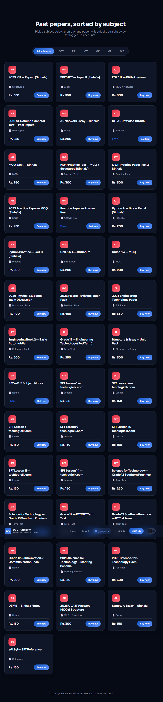
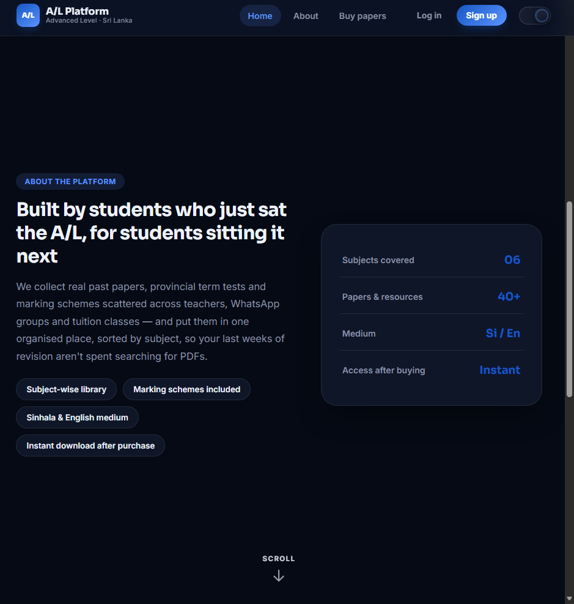
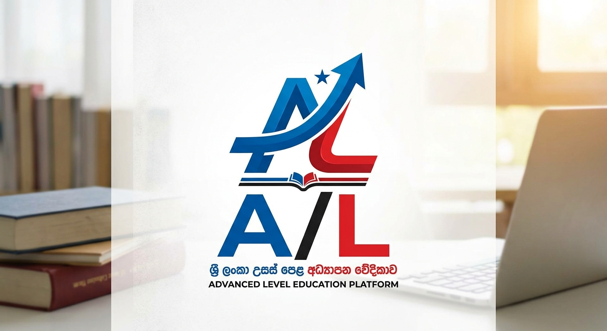

# A/L Education Platform - Sri Lanka 🎓📚
> **Master your A/L exam one past paper at a time.**

Welcome to the **A/L Education Platform**, an interactive web portal built to empower Sri Lankan Advanced Level (A/L) students with seamless access to past papers, model papers, and official marking schemes for technology and general education subjects.

---

## 📸 Platform Previews & Screenshots

### 🖥️ Main Dashboard Overview


### 📄 Paper Store & Portal Preview


### 🎨 Background & Theme Preview


---

## ✨ Core Features

* 📚 **Comprehensive Past Paper Library:** Instant access to past papers, model papers, and marking schemes across multiple A/L streams.
* 🎯 **Targeted Subjects:** Dedicated resources for ICT, SFT, ET, GIT, General English (GE), and General Knowledge (GK).
* 🔐 **Student Authentication Workflow:** Built-in dynamic client-side logic for registration and security (`auth.js`, `login.html`, `signup.html`).
* 💼 **Paper Management & User Portal:** Interactive interface for paper browsing and user profiles (`papers.html`, `profile.js`).
* 📱 **Fully Responsive UI:** Sleek, high-performance visual aesthetics built with clean HTML5, CSS3, and JavaScript.

---

## 🛠️ Tech Stack & Architecture

| Category | Components & Files |
| :--- | :--- |
| **Frontend Technologies** | HTML5, CSS3, JavaScript (ES6+) |
| **Styling & Theme** | Custom Modular CSS (`style.css`), Custom Assets (`bg.jpg`) |
| **Core Client Logic** | `auth.js`, `main.js`, `papers.js`, `profile.js` |
| **Application Pages** | `index.html`, `login.html`, `signup.html`, `papers.html` |

---

## 🚀 Quick Start & Installation

### 1. Clone the Repository
```bash
   git clone [https://github.com/diloshan-dev/education-platform.git](https://github.com/diloshan-dev/education-platform.git)
